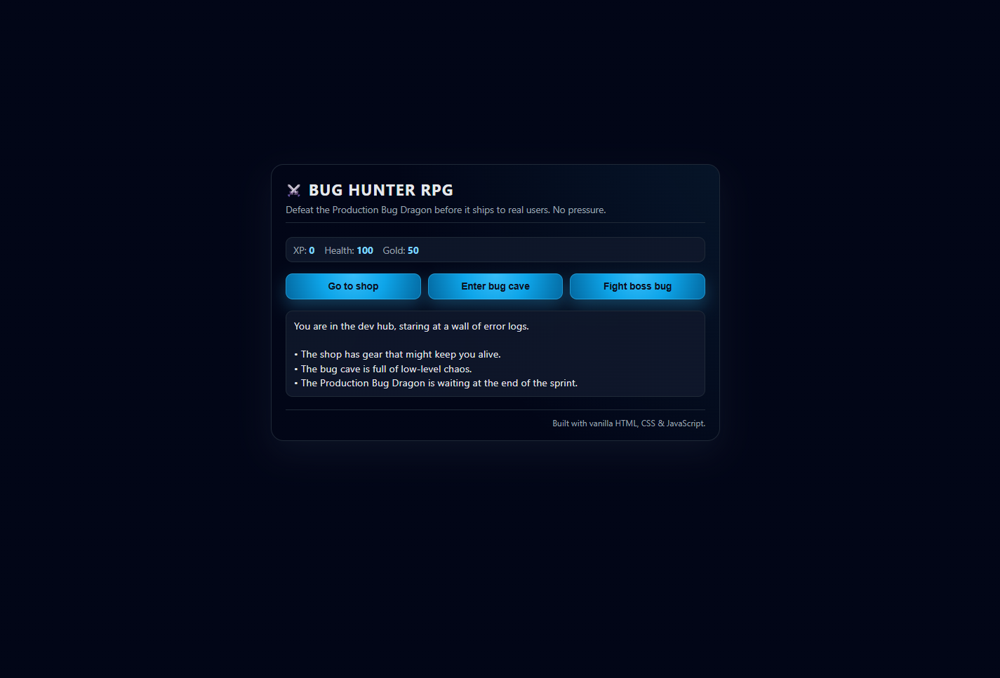

# Bug Hunter RPG

A browser-based mini RPG where you play as a developer trying to defeat the **Production Bug Dragon** before release night.

This project demonstrates state management, event-driven UI updates, and basic game mechanics using pure JavaScript — all wrapped in a clean, modern dark interface.

---

## Live Demo
🔗 https://sharpsanders.github.io/rpg-game/

---

## Overview

You begin in the **Dev Hub** with:

- XP: 0  
- Health: 100  
- Gold: 50  
- Inventory: `["rubber duck"]`

From there you can:

- Visit the **Shop** to buy health or upgrade tools
- Enter the **Bug Cave** to level up
- Fight the **Production Bug Dragon** to win

---

## Tech Stack

- **HTML5** – semantic layout & UI structure  
- **CSS3** – modern dark theme, gradients, glow effects  
- **JavaScript (ES6)** – game state, combat logic, inventory system  

No frameworks. No backend. Fully client-side.

---

## Key Features

### Turn-Based Combat
- Fight:
  - annoying lint error  
  - legacy feature request  
  - production bug dragon  
- Attack, dodge, or retreat
- Randomized damage system

### Weapons & Inventory
- Upgrade tools:
  - rubber duck
  - debugger
  - Stack Overflow tab
  - refactor hammer
- Weapons can randomly break (10% chance)
- Sell older tools for gold

### XP & Scaling System
- XP reduces incoming damage
- Monster strength scales by level + randomness
- Multiple win/lose states with replay system

### Shop System
- Buy health (10 gold → +10 health)
- Buy stronger weapons
- Dynamic UI updates based on inventory

### Easter Egg Mini-Game
- Unlock after defeating a monster
- Pick 2 or 8
- Random number draw (0–10)
- Win gold or lose health

---

## What This Project Demonstrates

- Managing application state with vanilla JavaScript
- Using structured data arrays (weapons, monsters, locations) to drive UI
- Decoupling UI updates from game logic
- Handling dynamic event bindings
- Implementing randomness in gameplay systems
- Designing an interactive experience without frameworks

---

## Code Structure

rpg-game/
├── index.html
├── styles.css
├── script.js
└── img/
└── Screenshot-rpg-game.png

The UI is controlled by a central `update(location)` function that dynamically updates:

- Button text
- Button event handlers
- Displayed content
- Monster stats visibility

This structure keeps the game modular and easy to extend.

---

## How To Run Locally

1. Clone the repository:
git clone https://github.com/SharpSanders/rpg-game.git

2. Open `index.html` in your browser

No build steps required.

---

## Future Improvements

- Add sound effects
- Animate health loss & damage numbers
- Add difficulty modes
- Persist stats using localStorage
- Refactor into modular architecture (classes or factory pattern)

---

## Author

Created by **Trevyn Sanders**  
Frontend Developer | Better Endeavors LLC